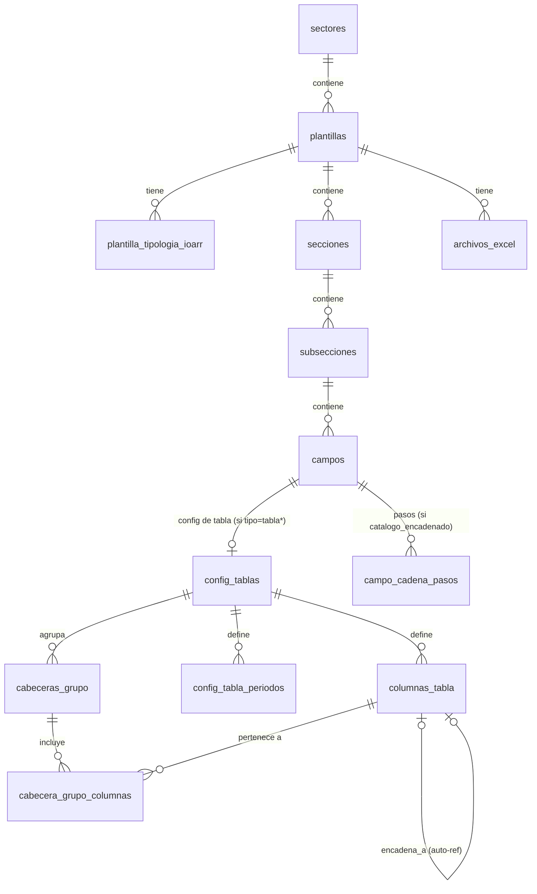

# Diseño de base de datos — Proyecta Fácil

Motor: **MariaDB 11**. Fuente del modelo: el dominio ya validado en el prototipo (`book/templates_editor/src/types/index.ts`). Este documento es la referencia autoritativa del esquema — las migraciones de CodeIgniter (`backend/app/Database/Migrations/`) son su implementación, no al revés. Si cambian, se actualiza primero este documento.

> La BD es intencionalmente cambiante: se versiona por migraciones incrementales, no por un dump único. Este documento describe el estado v1 (esquema base).

## Principios aplicados

Diseño guiado por las reglas clásicas de normalización (Codd; en la línea de C. Coronel & S. Morris, *Database Systems: Design, Implementation & Management*, y A. de Miguel/M. Piattini/E. Marcos vía A. Mora Rioja, *Diseño Lógico y Físico de Bases de Datos Relacionales*):

- **1FN (valores atómicos, sin grupos repetitivos):** todo atributo del prototipo que era un array (`tipologiasIoarr`, `cadena`, `features`, `nivelesDisponibles`, `periodos`, `inscritos`, `campos` de `CambioFicha`) se descompone en una tabla hija o de unión. El propio `Ejemplo.valores` (un diccionario `{identificador: valor}`) se descompone en la relación `valores_campo`, una fila por par (ejemplo, campo) — nunca una columna con un blob de todos los valores.
- **2FN (sin dependencia parcial de clave compuesta):** en toda tabla con clave primaria compuesta (las de unión: `valores_campo`, `plantilla_tipologia_ioarr`, `usuario_permisos`, `facturacion_addons`, etc.), cada atributo no-clave depende de la clave completa, nunca de una sola de sus columnas.
- **3FN (sin dependencia transitiva):** se eliminan del prototipo los campos que eran derivados/redundantes de una FK — ejemplos concretos:
  - `Sector.cantidadPlantillas` / `cantidadEjemplos`, `Plantilla.cantidadSecciones` / `cantidadEjemplos`, `Seccion.cantidadCampos` → **eliminados**. Se calculan con `COUNT()` (o una vista) cuando se necesiten; guardarlos como columna los deja desincronizables del dato real.
  - `FacturacionMock.plan` (nombre) y su relación con el precio → **eliminados**. `facturaciones.plan_id` es la única fuente de verdad; nombre y precio se obtienen por `JOIN` a `planes`. En el prototipo estaban duplicados porque no había base relacional detrás.
- **BCNF:** en este esquema todo determinante es clave candidata — no aparece el caso clásico de solape de claves candidatas que exige ir más allá de 3FN.

**Dos excepciones deliberadas (no son descuido, son decisión de diseño):**

1. `valores_campo.valor_json` — el valor de un campo tipo `tabla_jerarquica` es un árbol de profundidad variable (`TreeNode` con `hijos` recursivos). Normalizarlo por completo exigiría una tabla de adyacencia (`nodo_id`, `padre_id`) de complejidad desproporcionada para lo que se necesita hoy (nunca se filtra/busca *dentro* de una celda de tabla). Se guarda como `JSON` nativo de MariaDB — sigue siendo una columna atómica desde la perspectiva de la fila (1FN no se viola: la fila entera es una unidad, el JSON es su valor, no una lista de sub-filas mezcladas en la misma columna).
2. `campos.config_json` — corresponde a `Campo.config?: Record<string, unknown>`, un cajón de propiedades ad-hoc sin forma fija en el prototipo. Se deja como `JSON` nullable hasta que su contenido real se estabilice; cuando se sepa qué guarda de verdad, se promueve a columnas propias.

**Cambio de seguridad respecto al prototipo:** `usuarios.password_hash` — el prototipo guarda la contraseña en texto plano (localStorage, sin backend). En la app real **nunca** se guarda en texto plano: se hashea con Argon2id/bcrypt (`password_hash()` de PHP) antes de persistir.

**Cambio de almacenamiento de archivos:** `ArchivoExcel.dataUrl` (base64 inline) del prototipo se reemplaza por `archivos_excel.url` apuntando a Cloudinary — nunca se guarda el binario ni un base64 en la fila.

---

## Módulo 1 — Catálogo de contenido (Sector → Plantilla → Sección → Subsección → Campo)

| Tabla | Columnas clave | Notas |
|---|---|---|
| `sectores` | `id` PK, `codigo` UNIQUE, `nombre`, `icono`, `color_accent`, `descripcion` NULL, `tipo_sector` ENUM('Sectorial','General'), `activo` | — |
| `plantillas` | `id` PK, `sector_id` FK, `codigo` UNIQUE, `nombre`, `descripcion`, `instrumento` ENUM('formato','ioarr','ficha_tecnica','perfil'), `fecha_actualizacion`, `archivo_default_url` NULL, `disponible_nivel0` BOOL, `asignado_archivo_id` FK→archivos_excel NULL | `asignado_archivo_id` reemplaza a `CatalogoExcelPlantilla.asignadoId` — apunta a cuál de los `archivos_excel` de esta plantilla es el activo |
| `plantilla_tipologia_ioarr` | (`plantilla_id` FK, `tipologia` ENUM) PK compuesta | descompone `Plantilla.tipologiasIoarr[]` |
| `secciones` | `id` PK, `plantilla_id` FK, `numero`, `nombre`, `hoja` NULL, `orden` SMALLINT | UNIQUE(`plantilla_id`,`numero`) |
| `subsecciones` | `id` PK, `seccion_id` FK, `codigo`, `nombre`, `ayuda` TEXT NULL (Markdown), `orden` | UNIQUE(`seccion_id`,`codigo`) |
| `campos` | `id` PK, `subseccion_id` FK, `identificador`, `etiqueta`, `tipo` ENUM(15 valores), `editable` BOOL, `requerido` BOOL, `descripcion` NULL, `fuente_catalogo` NULL, `valor_ejemplo` TEXT NULL, `captura_columna` NULL, `captura_fila` NULL, `captura_abarca_columnas` NULL, `captura_abarca_filas` NULL, `config_json` JSON NULL, `orden` | UNIQUE(`subseccion_id`,`identificador`) |
| `campo_cadena_pasos` | (`campo_id` FK, `orden`) PK | descompone `Campo.cadena[]` (solo `tipo='catalogo_encadenado'`) |
| `config_tablas` | `campo_id` PK/FK (1:1 con `campos`) | `subtipo` ENUM('filas_dinamicas','matriz_por_periodos','jerarquica'), `filas_iniciales`, `max_filas`, `agrupador` BOOL, `agrupador_abarca_columnas`, `columna_dinamica_id` FK→columnas_tabla NULL (se agrega por ALTER tras crear `columnas_tabla`, ver migración 2), `captura_hoja`, `captura_columna_inicial`, `captura_fila_inicial`, `captura_filas_base` |
| `columnas_tabla` | `id` PK, `config_tabla_campo_id` FK, `columna_id_logico` (id de negocio usado en `valor_json`), `nombre`, `tipo` ENUM(11 valores), `nivel` ENUM('padre','hijo') NULL, `ancho` NULL, `requerido` BOOL, `fuente_catalogo` NULL, `encadena_a_columna_id` FK→columnas_tabla NULL (auto-referencia), `formula` NULL, `columna_excel` NULL, `abarca_columnas_excel` NULL, `orden` | UNIQUE(`config_tabla_campo_id`,`columna_id_logico`) |
| `config_tabla_periodos` | (`config_tabla_campo_id` FK, `orden`) PK, `periodo_nombre` | descompone `ConfigTabla.periodos[]` |
| `cabeceras_grupo` | `id` PK, `config_tabla_campo_id` FK, `titulo`, `orden` | — |
| `cabecera_grupo_columnas` | (`cabecera_grupo_id` FK, `columna_tabla_id` FK) PK | descompone `CabeceraGrupo.hijoIds[]` (N:M) |

## Módulo 2 — Ejemplos y valores capturados

| Tabla | Columnas clave | Notas |
|---|---|---|
| `ejemplos` | `id` PK, `plantilla_id` FK, `nombre`, `subtitulo` NULL, `detalle` NULL, `activo` BOOL, `propietario_usuario_id` FK→usuarios NULL, `creado_por_usuario_id` FK→usuarios NULL, `compartida` BOOL | `propietario_usuario_id` NULL = ejemplo de referencia del admin; no-NULL = ficha de un cliente (cuenta titular) |
| `ejemplo_tipologia_ioarr` | (`ejemplo_id` FK, `tipologia` ENUM) PK | descompone `Ejemplo.tipologiasIoarr[]` |
| `valores_campo` | (`ejemplo_id` FK, `campo_id` FK) PK, `valor_texto` TEXT NULL, `valor_json` JSON NULL | reemplaza a `Ejemplo.valores: Record<string,string>`. Campos simples → `valor_texto`; campos `tabla`/`tabla_jerarquica` → `valor_json` (ver excepción deliberada #1 arriba) |
| `archivos_excel_ejemplo` | `ejemplo_id` PK/FK (1:1) | copia/snapshot de `archivos_excel` tomada al crear la ficha — `nombre`, `url`, `fecha_subida` |

## Módulo 3 — Usuarios, roles y permisos

| Tabla | Columnas clave | Notas |
|---|---|---|
| `tipos_usuario` | `id` PK, `nombre` UNIQUE, `nivel_base` ENUM('administrador','cliente') | etiquetas personalizadas (ej. "Soporte Técnico") |
| `usuarios` | `id` PK, `nombre`, `usuario` UNIQUE, `password_hash`, `rol` ENUM('superusuario','administrador','cliente'), `apodo` NULL, `tema` ENUM('claro','oscuro','sistema'), `estado` ENUM('activo','inactivo'), `cuenta_cliente_id` FK→usuarios NULL (auto-ref, colaborador→titular), `tipo_usuario_id` FK→tipos_usuario NULL | — |
| `permisos_catalogo` | `clave` VARCHAR(50) PK, `descripcion` NULL | catálogo estático (20 valores del enum `PermisoId`) |
| `usuario_permisos` | (`usuario_id` FK, `permiso_clave` FK) PK | overrides explícitos; si un usuario no tiene fila para una clave, el permiso se calcula por defecto en la capa de aplicación según rol/plan |

## Módulo 4 — Planes, add-ons y facturación

| Tabla | Columnas clave | Notas |
|---|---|---|
| `planes` | `id` PK, `numero_nivel` UNIQUE, `nombre`, `precio` DECIMAL(10,2), `periodicidad`, `limite_fichas_base`, `limite_usuarios_base` | — |
| `plan_features` | (`plan_id` FK, `orden`) PK, `feature_texto` | descompone `Plan.features[]` |
| `add_ons` | `id` PK, `nombre`, `descripcion`, `precio` DECIMAL(10,2), `recurrente` BOOL | — |
| `add_on_niveles_disponibles` | (`add_on_id` FK, `numero_nivel`) PK | descompone `AddOn.nivelesDisponibles[]` |
| `facturaciones` | `usuario_id` PK/FK (1:1, solo titulares), `plan_id` FK, `cancelada` BOOL, `fecha_renovacion` DATE NULL, `fecha_inicio_plan` DATETIME NULL, `metodo_pago` ENUM(5 valores), `tarjeta_marca` NULL, `tarjeta_ultimos4` CHAR(4) NULL, `telefono_pago` NULL | sin columna `plan`/`precio` — vía JOIN a `planes` (ver 3FN arriba) |
| `facturas` | `id` PK, `facturacion_usuario_id` FK, `fecha` DATE, `total` DECIMAL(10,2), `estado` ENUM('Pagado','Pendiente') | — |
| `facturacion_addons` | (`facturacion_usuario_id` FK, `add_on_id` FK) PK, `cantidad` SMALLINT UNSIGNED | descompone `FacturacionMock.addons: Record<addonId,cantidad>` |

## Módulo 5 — Mentorías grupales

| Tabla | Columnas clave | Notas |
|---|---|---|
| `sesiones_mentoria` | `id` PK, `tema`, `mentor`, `fecha` DATETIME, `cupos_totales` SMALLINT UNSIGNED, `link_reunion`, `grabacion_url` NULL | — |
| `mentoria_inscripciones` | (`sesion_id` FK, `usuario_id` FK) PK, `fecha_inscripcion` DATETIME | descompone `SesionMentoria.inscritos[]` |
| `preguntas_mentoria` | `id` PK, `sesion_id` FK, `usuario_id` FK, `pregunta` TEXT, `fecha_pregunta` DATETIME, `respuesta` TEXT NULL, `fecha_respuesta` DATETIME NULL | — |

## Módulo 6 — Auditoría

| Tabla | Columnas clave | Notas |
|---|---|---|
| `actividad_reciente` | `id` PK, `mensaje`, `color` ENUM(5 valores), `created_at` DATETIME | feed global del dashboard |
| `historial_cambios` | `id` PK, `ejemplo_id` FK, `usuario_id` FK, `fecha` DATETIME | una fila por cada "Guardar" con cambios reales |
| `historial_cambio_campos` | (`historial_cambio_id` FK, `identificador`) PK, `etiqueta`, `valor_anterior` TEXT, `valor_nuevo` TEXT | descompone `CambioFicha.campos[]` |

## Módulo 7 — Archivos Excel

| Tabla | Columnas clave | Notas |
|---|---|---|
| `archivos_excel` | `id` PK, `plantilla_id` FK, `nombre`, `url` (Cloudinary), `fecha_subida` DATETIME | catálogo de archivos por plantilla; cuál está activo lo apunta `plantillas.asignado_archivo_id` |

---

## Orden de migraciones (respeta dependencias de FK)

1. `sectores`
2. `usuarios` (sin `tipo_usuario_id` todavía — se agrega en el paso 4) — necesaria temprano porque `plantillas`/`ejemplos` no dependen de ella pero `usuario_permisos`, `facturaciones`, etc. sí
3. `plantillas`, `plantilla_tipologia_ioarr`, `archivos_excel` (+ ALTER `plantillas.asignado_archivo_id`)
4. `tipos_usuario` (+ ALTER `usuarios.tipo_usuario_id`), `permisos_catalogo`, `usuario_permisos`
5. `secciones`, `subsecciones`, `campos`, `campo_cadena_pasos`
6. `config_tablas`, `columnas_tabla` (+ ALTER `config_tablas.columna_dinamica_id`), `config_tabla_periodos`, `cabeceras_grupo`, `cabecera_grupo_columnas`
7. `ejemplos`, `ejemplo_tipologia_ioarr`, `valores_campo`, `archivos_excel_ejemplo`
8. `planes`, `plan_features`, `add_ons`, `add_on_niveles_disponibles`, `facturaciones`, `facturas`, `facturacion_addons`
9. `sesiones_mentoria`, `mentoria_inscripciones`, `preguntas_mentoria`
10. `actividad_reciente`, `historial_cambios`, `historial_cambio_campos`

## Pendiente / a revisar en la siguiente pasada

- Índices adicionales de performance (ej. `valores_campo(campo_id)` para queries "en qué fichas se usó este campo") — se agregan cuando haya patrones de consulta reales, no especulativamente.
- Soft deletes (`deleted_at`) — evaluar por tabla según si el prototipo necesita "papelera" en algún flujo.
- Particionamiento de `historial_cambios`/`actividad_reciente` si el volumen crece mucho — prematuro hoy.
