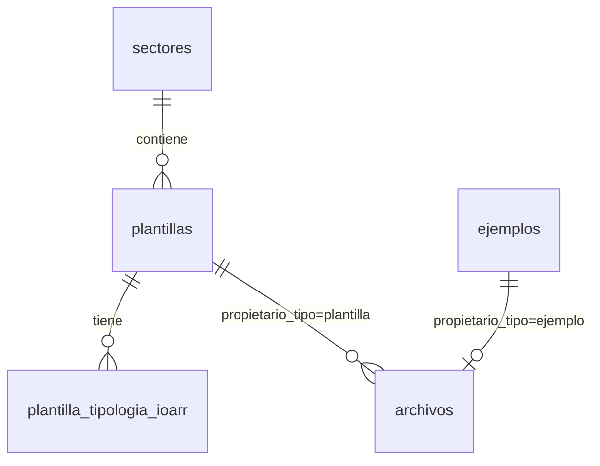
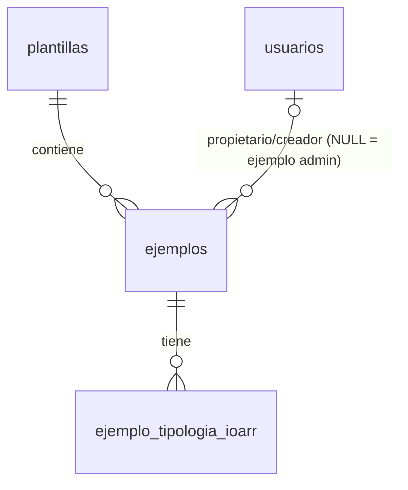

# Diseño de base de datos — Proyecta Fácil

Motor de **desarrollo local**: **PostgreSQL 16** (por preferencia/dominio del equipo). Motor **objetivo de producción**: **MariaDB 11** (documentado en Notion "STACK TÉCNICO") — la migración de vuelta a MariaDB queda pendiente para cuando se prepare el deploy real; ver "Portabilidad del motor" abajo para lo que eso implica en las migraciones. Fuente del modelo: el dominio ya validado en el prototipo (`book/templates_editor/src/types/index.ts`). Este documento es la referencia autoritativa del esquema — las migraciones de CodeIgniter (`backend/app/Database/Migrations/`) son su implementación, no al revés. Si cambian, se actualiza primero este documento.

> La BD es intencionalmente cambiante: se versiona por migraciones incrementales, no por un dump único. Este documento describe el estado **v2** (colapso del árbol de contenido a archivos JSON+Excel — ver "Cambio de diseño v2" abajo). El estado v1 (con `secciones`/`subsecciones`/`campos`/`config_tablas`/... como tablas) queda obsoleto y ya no describe el esquema real.

## Portabilidad del motor (Postgres hoy, MariaDB después)

Como se desarrolla sobre Postgres pero el objetivo es MariaDB, las migraciones evitan sintaxis específica de un solo motor cuando hay una alternativa portable igual de simple:

- **"Enums"** (`tipo_sector`, `rol`, `instrumento`, `tipologia`, `metodo_pago`, etc.): CodeIgniter traduce `'type' => 'ENUM'` de forma nativa en MySQL/MariaDB, pero Postgres no tiene un tipo `ENUM` inline (solo tipos con nombre vía `CREATE TYPE`, y el driver Postgre de CI4 no hace esa traducción). Se optó por `VARCHAR` + `CHECK` constraint en vez de perseguir el tipo nativo de cada motor — funciona idéntico en ambos, sin SQL condicional por driver. Helper: `App\Database\Migrations\Support\PortableEnumTrait` (`enumField()` para la columna, `addEnumCheck()` para la restricción) — toda migración nueva que necesite un "enum" debe usar este trait, no `'type' => 'ENUM'` directo.
- `database.default.charset` en `backend/.env` está en `utf8` (no `utf8mb4`, que es un nombre de charset exclusivo de MySQL/MariaDB) — Postgres no reconoce `utf8mb4`.

## Cambio de diseño v2 (respecto a v1)

**Decisión:** las 3 versiones de una plantilla/ficha (**Estructura** = molde vacío, **Ejemplos** = casos resueltos por el admin, **Proyecto** = ficha del cliente final) se guardan como **archivo JSON**, no como árbol de tablas relacionales. Cada JSON está pareado 1:1 con un **Excel** (mismo layout de celdas — el JSON referencia coordenadas de ese Excel específico vía `captura`). El modelo relacional agrupa **solo hasta Plantilla** (por Sector) y **hasta Ejemplo** (por Plantilla/Usuario) — nunca desciende a Sección → Subsección → Campo.

Esto reemplaza por completo lo que en v1 era el Módulo 1 "Catálogo de contenido" (12 tablas) y elimina `valores_campo` del Módulo 2. Las tablas que desaparecen: `secciones`, `subsecciones`, `campos`, `campo_cadena_pasos`, `config_tablas`, `columnas_tabla`, `config_tabla_periodos`, `cabeceras_grupo`, `cabecera_grupo_columnas`, `valores_campo` — **10 tablas menos**, el esquema pasa de ~34 a ~24 tablas.

**Por qué es correcto normalizar así (y no un atajo):** el árbol Sección→Subsección→Campo→(Tabla→Columna→Cabecera) nunca se consulta ni se filtra por SQL a nivel de campo individual — siempre se lee/escribe completo, de una vez, como el documento que alimenta al editor o al motor de exportación a Excel. Modelarlo como filas relacionales solo añadía JOINs de 5+ niveles sin ninguna consulta real que los aprovechara. Esto es la misma justificación que ya se usaba para la excepción `valor_json` en v1 (ver "Excepciones deliberadas" abajo), simplemente extendida a todo el árbol de contenido en vez de solo a las celdas de tabla jerárquica.

**Formato exacto del JSON:** ya está definido y documentado en Notion — página *"DOCUMENTACIÓN, CONTEXTO PARA LA IA"* (`schema_version`, `formato`, `secciones[]` con nodos `tipo_nodo: "seccion" | "grupo" | "campo"`, cada campo con su `captura` de coordenadas Excel y su `valor`). Ese documento es la fuente autoritativa del *contenido* del JSON; este documento (`database-design.md`) es la fuente autoritativa de *dónde vive* ese JSON (qué fila de qué tabla apunta a su URL).

## Principios aplicados

Diseño guiado por las reglas clásicas de normalización (Codd; en la línea de C. Coronel & S. Morris, *Database Systems: Design, Implementation & Management*, y A. de Miguel/M. Piattini/E. Marcos vía A. Mora Rioja, *Diseño Lógico y Físico de Bases de Datos Relacionales*):

- **1FN (valores atómicos, sin grupos repetitivos):** todo atributo del prototipo que era un array simple (`tipologiasIoarr`, `features`, `nivelesDisponibles`, `inscritos`, `campos` de `CambioFicha`) se descompone en una tabla hija o de unión.
- **2FN (sin dependencia parcial de clave compuesta):** en toda tabla con clave primaria compuesta (las de unión: `plantilla_tipologia_ioarr`, `ejemplo_tipologia_ioarr`, `usuario_permisos`, `facturacion_addons`, etc.), cada atributo no-clave depende de la clave completa, nunca de una sola de sus columnas.
- **3FN (sin dependencia transitiva):** se eliminan del prototipo los campos que eran derivados/redundantes de una FK — ejemplos concretos:
  - `Sector.cantidadPlantillas` / `cantidadEjemplos`, `Plantilla.cantidadSecciones` / `cantidadEjemplos` → **eliminados**. Se calculan con `COUNT()` (o una vista) cuando se necesiten; guardarlos como columna los deja desincronizables del dato real.
  - `FacturacionMock.plan` (nombre) y su relación con el precio → **eliminados**. `facturaciones.plan_id` es la única fuente de verdad; nombre y precio se obtienen por `JOIN` a `planes`. En el prototipo estaban duplicados porque no había base relacional detrás.
- **BCNF:** en este esquema todo determinante es clave candidata — no aparece el caso clásico de solape de claves candidatas que exige ir más allá de 3FN.

**Excepción deliberada (no es descuido, es decisión de diseño):**

- `campos.config_json` — ya no aplica en v2 (la tabla `campos` no existe). El árbol completo de contenido (equivalente a lo que en v1 exigía esta excepción para una sola celda de tabla jerárquica) ahora vive como JSON externo — ver "Cambio de diseño v2" arriba.

**Cambio de seguridad respecto al prototipo:** `usuarios.password_hash` — el prototipo guarda la contraseña en texto plano (localStorage, sin backend). En la app real **nunca** se guarda en texto plano: se hashea con Argon2id/bcrypt (`password_hash()` de PHP) antes de persistir.

**Cambio de almacenamiento de archivos:** todo archivo (Excel o JSON) se referencia por `url` apuntando a Cloudinary/almacenamiento externo — nunca se guarda el binario ni un base64 en la fila.

---

## Módulo 1 — Catálogo (Sector → Plantilla → Archivo)

| Tabla | Columnas clave | Notas |
|---|---|---|
| `sectores` | `id` PK, `codigo` UNIQUE, `nombre`, `icono`, `color_accent`, `descripcion` NULL, `tipo_sector` ENUM('Sectorial','General'), `activo` | — |
| `plantillas` | `id` PK, `sector_id` FK, `codigo` UNIQUE, `nombre`, `descripcion`, `instrumento` ENUM('formato','ioarr','ficha_tecnica','perfil'), `fecha_actualizacion`, `archivo_default_url` NULL, `disponible_nivel0` BOOL, `asignado_archivo_id` FK→archivos NULL, `estado` ENUM('publicado','archivado') default 'archivado' | La agrupación relacional para de aquí: no hay `secciones`/`campos` como tablas — su contenido vive en el JSON pareado con su archivo en `archivos`. `estado` es independiente del `estado` de sus `ejemplos` — publicar la plantilla no publica sus ejemplos ni viceversa. |
| `plantilla_tipologia_ioarr` | (`plantilla_id` FK, `tipologia` ENUM) PK compuesta | descompone `Plantilla.tipologiasIoarr[]` — se mantiene relacional porque sí se filtra/consulta (tabs de tipología en la UI) |
| `archivos` | `id` PK, `propietario_tipo` ENUM('plantilla','ejemplo'), `plantilla_id` FK NULL, `ejemplo_id` FK NULL (UNIQUE), `nombre`, `url` (Cloudinary, el Excel), `contenido_json` (JSON nativo de la BD, pareado 1:1 con ese Excel), `fecha_subida` DATETIME | tabla única para **todo** archivo Excel+JSON del sistema, sin importar el dueño — reemplaza a `archivos_excel` + `archivos_ejemplo` de una iteración anterior de este documento. `plantilla_id`/`ejemplo_id` son mutuamente excluyentes (CHECK), coherente con `propietario_tipo`. Ver detalle abajo. |

### Tabla unificada `archivos` — por qué una sola tabla y no una por dueño

En vez de crear una tabla `archivos_X` nueva cada vez que aparece un dueño distinto de archivo (plantilla, ejemplo, y lo que venga después), `archivos` es genérica: un discriminador (`propietario_tipo`) más dos FK nullable mutuamente excluyentes (`plantilla_id`, `ejemplo_id`), reforzadas con un `CHECK` que exige que exactamente una de las dos esté llena y coincida con `propietario_tipo`. Si en el futuro aparece un tercer dueño, se agrega una columna FK nullable más y su rama en el `CHECK` — no una tabla nueva.

**Por qué `url` va a Cloudinary pero `contenido_json` no:** son dos naturalezas distintas de dato. El Excel es un binario que solo se sirve/descarga tal cual — un CDN (Cloudinary) es exactamente para eso. El JSON es contenido estructurado que el backend lee y reescribe en cada petición del editor (crear campo, guardar valores, etc.) — enrutarlo por un CDN externo solo añadiría una ida y vuelta de red por cada lectura, sin ningún beneficio de los que sí justifican Cloudinary para el Excel. Se guarda como columna `JSON` nativa, misma justificación que la excepción deliberada de `valor_json` en v1 (ver "Excepciones deliberadas" arriba) — ahora aplicada al documento completo, no solo a una celda.

Dos usos distintos de la misma tabla, según quién sea el dueño:
- **Dueño = plantilla:** catálogo de candidatos (puede haber varios archivos por plantilla); `plantillas.asignado_archivo_id` apunta a cuál está activo/publicado. `contenido_json` es el JSON de la versión **Estructura**.
- **Dueño = ejemplo:** relación 1:1 (por eso `ejemplo_id` tiene UNIQUE) — un ejemplo/ficha tiene como máximo un archivo propio, sin catálogo de candidatos. `contenido_json` es el JSON de la versión **Ejemplos** o **Proyecto** (según `ejemplos.propietario_usuario_id`, ver Módulo 2).

Sobre lo que reemplaza: `contenido_json` en cualquiera de los dos casos sustituye a todo el árbol `secciones→campos→config_tablas→columnas_tabla` de v1 (ver "Cambio de diseño v2"), y el caso `propietario_tipo='ejemplo'` sustituye además a `valores_campo` de v1 — antes una fila por (ejemplo, campo), ahora todos los valores viven dentro de `contenido_json`.

### Cómo se navega esto en la UI

Dentro de cada Sector, las plantillas se agrupan en **4 pestañas fijas** según `plantillas.instrumento`: **Formatos**, **IOARR**, **Fichas Técnicas**, **Perfiles** (así se ve en `SectorDetallePage`, con contador por pestaña). Es un ENUM de 4 valores, no una tabla aparte — es una taxonomía estable del dominio Invierte.pe que no crece con el tiempo, distinta del caso de `sectores`/`plantillas` que sí son catálogos abiertos que el admin edita.

**No confundir `instrumento` con `plantilla_tipologia_ioarr`:** son dos clasificaciones independientes sobre la misma plantilla.
- `instrumento` — a qué pestaña pertenece (1 valor fijo por plantilla, siempre presente).
- `plantilla_tipologia_ioarr` — sub-tipología aplicable solo cuando `instrumento='ioarr'` (optimización / ampliación marginal / reposición / rehabilitación); una plantilla IOARR puede tener varias a la vez, por eso sí es una tabla N:M y no un ENUM en la misma columna.

Los contadores que muestra la UI (`X plantillas`, `X ejemplos cargados` en la tarjeta de sector; `secciones`/`ejemplos` en la tabla de plantillas) **nunca se guardan como columna** — se calculan con `COUNT()` al leer, siguiendo el principio 3FN de este documento (ver "Principios aplicados"). El "0 secciones" que hoy se ve en la tabla de plantillas queda obsoleto como concepto en v2: al no existir la tabla `secciones`, ese contador se reemplaza por si la plantilla ya tiene o no un archivo en `archivos` con `contenido_json` cargado.

## Módulo 2 — Ejemplos (casos resueltos y fichas de cliente)

| Tabla | Columnas clave | Notas |
|---|---|---|
| `ejemplos` | `id` PK, `plantilla_id` FK, `nombre`, `subtitulo` NULL, `detalle` NULL, `activo` BOOL, `propietario_usuario_id` FK→usuarios NULL, `creado_por_usuario_id` FK→usuarios NULL, `compartida` BOOL, `estado` ENUM('publicado','archivado') default 'archivado' | `propietario_usuario_id` NULL = ejemplo de referencia del admin (versión **Ejemplos**); no-NULL = ficha de un cliente (cuenta titular, versión **Proyecto**) — ambas versiones comparten esta misma tabla, se diferencian solo por este campo. `estado` solo se gestiona desde la UI admin (catálogo de ejemplos de referencia) — las fichas de cliente nacen y quedan en `archivado` sin mostrar el control. |
| `ejemplo_tipologia_ioarr` | (`ejemplo_id` FK, `tipologia` ENUM) PK | descompone `Ejemplo.tipologiasIoarr[]` |

El archivo Excel+JSON de cada ejemplo/ficha ya no tiene tabla propia — es una fila de `archivos` (Módulo 1) con `propietario_tipo='ejemplo'` y `ejemplo_id` apuntando aquí. Ver "Tabla unificada `archivos`" arriba.

## Módulo 3 — Usuarios, roles y permisos

| Tabla | Columnas clave | Notas |
|---|---|---|
| `tipos_usuario` | `id` PK, `nombre` UNIQUE, `nivel_base` ENUM('administrador','cliente') | etiquetas personalizadas (ej. "Soporte Técnico") |
| `usuarios` | `id` PK, `nombre`, `usuario` UNIQUE, `password_hash`, `rol` ENUM('superusuario','administrador','cliente'), `apodo` NULL, `tema` ENUM('claro','oscuro','sistema'), `estado` ENUM('activo','inactivo'), `cuenta_cliente_id` FK→usuarios NULL (auto-ref, colaborador→titular), `tipo_usuario_id` FK→tipos_usuario NULL | — |
| `permisos_catalogo` | `clave` VARCHAR(50) PK, `descripcion` NULL | catálogo estático (20 valores del enum `PermisoId`) |
| `usuario_permisos` | (`usuario_id` FK, `permiso_clave` FK) PK | overrides explícitos; si un usuario no tiene fila para una clave, el permiso se calcula por defecto en la capa de aplicación según rol/plan |

## Módulo 4 — Planes, add-ons y facturación

| Tabla | Columnas clave | Notas |
|---|---|---|
| `planes` | `id` PK, `numero_nivel` UNIQUE, `nombre`, `precio` DECIMAL(10,2), `periodicidad`, `limite_fichas_base`, `limite_usuarios_base` | — |
| `plan_features` | (`plan_id` FK, `orden`) PK, `feature_texto` | descompone `Plan.features[]` |
| `add_ons` | `id` PK, `nombre`, `descripcion`, `precio` DECIMAL(10,2), `recurrente` BOOL | — |
| `add_on_niveles_disponibles` | (`add_on_id` FK, `numero_nivel`) PK | descompone `AddOn.nivelesDisponibles[]` |
| `facturaciones` | `usuario_id` PK/FK (1:1, solo titulares), `plan_id` FK, `cancelada` BOOL, `fecha_renovacion` DATE NULL, `fecha_inicio_plan` DATETIME NULL, `metodo_pago` ENUM(5 valores), `tarjeta_marca` NULL, `tarjeta_ultimos4` CHAR(4) NULL, `telefono_pago` NULL | sin columna `plan`/`precio` — vía JOIN a `planes` (ver 3FN arriba) |
| `facturas` | `id` PK, `facturacion_usuario_id` FK, `fecha` DATE, `total` DECIMAL(10,2), `estado` ENUM('Pagado','Pendiente') | — |
| `facturacion_addons` | (`facturacion_usuario_id` FK, `add_on_id` FK) PK, `cantidad` SMALLINT UNSIGNED | descompone `FacturacionMock.addons: Record<addonId,cantidad>` |

## Módulo 5 — Mentorías grupales

| Tabla | Columnas clave | Notas |
|---|---|---|
| `sesiones_mentoria` | `id` PK, `tema`, `mentor`, `fecha` DATETIME, `cupos_totales` SMALLINT UNSIGNED, `link_reunion`, `grabacion_url` NULL | — |
| `mentoria_inscripciones` | (`sesion_id` FK, `usuario_id` FK) PK, `fecha_inscripcion` DATETIME | descompone `SesionMentoria.inscritos[]` |
| `preguntas_mentoria` | `id` PK, `sesion_id` FK, `usuario_id` FK, `pregunta` TEXT, `fecha_pregunta` DATETIME, `respuesta` TEXT NULL, `fecha_respuesta` DATETIME NULL | — |

## Módulo 6 — Auditoría

| Tabla | Columnas clave | Notas |
|---|---|---|
| `actividad_reciente` | `id` PK, `mensaje`, `color` ENUM(5 valores), `created_at` DATETIME | feed global del dashboard |
| `historial_cambios` | `id` PK, `ejemplo_id` FK, `usuario_id` FK, `fecha` DATETIME | una fila por cada "Guardar" con cambios reales |
| `historial_cambio_campos` | (`historial_cambio_id` FK, `identificador`) PK, `etiqueta`, `valor_anterior` TEXT, `valor_nuevo` TEXT | descompone `CambioFicha.campos[]` — `identificador` es un string libre (id del campo dentro del JSON), nunca fue FK a una tabla `campos`, así que esta tabla no se ve afectada por el cambio de diseño v2 |

---

## Orden de migraciones (respeta dependencias de FK)

1. `sectores`
2. `usuarios` (sin `tipo_usuario_id` todavía — se agrega en el paso 4)
3. `plantillas`, `plantilla_tipologia_ioarr` (sin `asignado_archivo_id` todavía — se agrega en el paso 5, junto con `archivos`)
4. `tipos_usuario` (+ ALTER `usuarios.tipo_usuario_id`), `permisos_catalogo`, `usuario_permisos`
5. `ejemplos`, `ejemplo_tipologia_ioarr`, `archivos` (+ ALTER `plantillas.asignado_archivo_id`) — `archivos` se crea recién aquí porque referencia tanto a `plantillas` como a `ejemplos`
6. `planes`, `plan_features`, `add_ons`, `add_on_niveles_disponibles`, `facturaciones`, `facturas`, `facturacion_addons`
7. `sesiones_mentoria`, `mentoria_inscripciones`, `preguntas_mentoria`
8. `actividad_reciente`, `historial_cambios`, `historial_cambio_campos`
9. ALTER `plantillas.estado`, `ejemplos.estado` (columnas agregadas después, ver migración `AddEstadoToPlantillasYEjemplos`)

## Pendiente / a revisar en la siguiente pasada

- Índices adicionales de performance — se agregan cuando haya patrones de consulta reales, no especulativamente.
- Soft deletes (`deleted_at`) — evaluar por tabla según si el prototipo necesita "papelera" en algún flujo.
- Particionamiento de `historial_cambios`/`actividad_reciente` si el volumen crece mucho — prematuro hoy.
